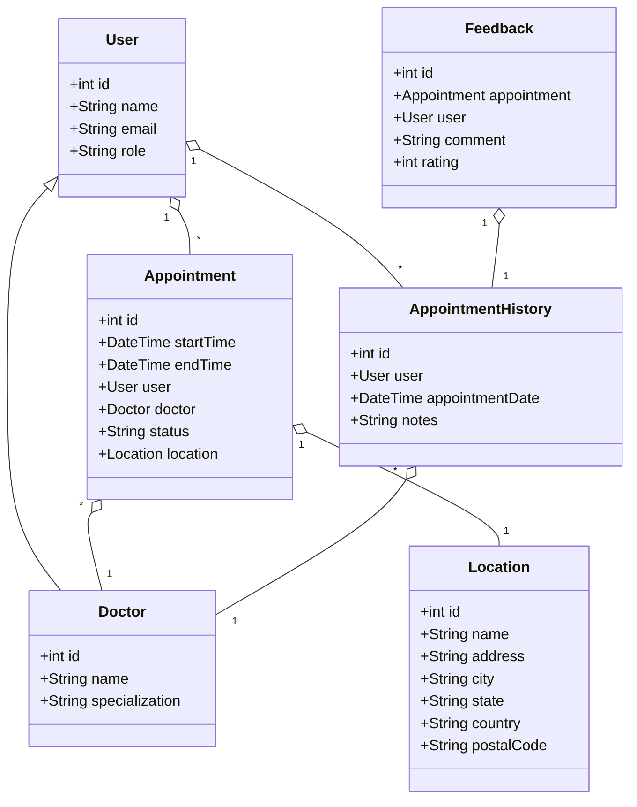

# Appointment Booking Object Model

```mermaid

---

Appointment Booking Object Model with Feedback

---

classDiagram
    class User {
        +int id
        +String name
        +String email
        +String role
    }

    class Doctor {
        +int id
        +String name
        +String specialization
    }

    class Appointment {
        +int id
        +DateTime startTime
        +DateTime endTime
        +User user
        +Doctor doctor
        +String status
        +Location location
    }

    class AppointmentHistory {
        +int id
        +User user
        +DateTime appointmentDate
        +String notes
    }

    class Feedback {
        +int id
        +Appointment appointment
        +User user
        +String comment
        +int rating
    }

    class Location {
        +int id
        +String name
        +String address
        +String city
        +String state
        +String country
        +String postalCode
    }

    User <|-- Doctor
    Appointment "*" o-- "1" Doctor
    AppointmentHistory "*" o-- "1" Doctor
    User "1" o-- "*" Appointment
    User "1" o-- "*" AppointmentHistory
    Feedback "1" o-- "1" AppointmentHistory
    Appointment "1" o-- "1" Location

```