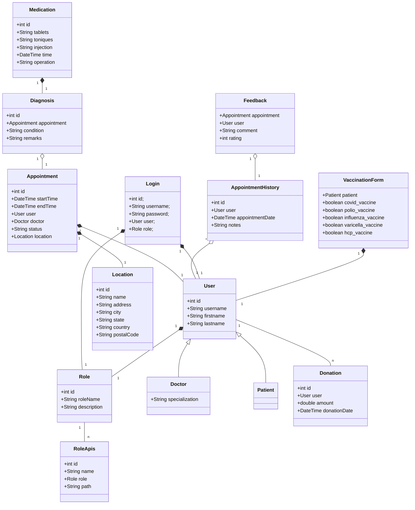

# Object Model

```mermaid
---
Object Model For CodeCare
---

classDiagram
    class Role {
        +int id
        +String roleName
        +String description
    }
    class RoleApis {
        +int id
        +String name
        +Role role
        +String path
    }
    class Login {
        +int id;
        +String username;
        +String password;
        +User user;
        +Role role;
    }
    class User {
        +int id
        +String username
        +String firstname
        +String lastname
    }

    class Doctor {
        +String specialization
    }

    class Patient {

    }

    class Appointment {
        +int id
        +DateTime startTime
        +DateTime endTime
        +User user
        +Doctor doctor
        +String status
        +Location location
    }

    class AppointmentHistory {
        +int id
        +User user
        +DateTime appointmentDate
        +String notes
    }

    class Feedback {
        +Appointment appointment
        +User user
        +String comment
        +int rating
    }

    class Location {
        +int id
        +String name
        +String address
        +String city
        +String state
        +String country
        +String postalCode
    }

    class Donation {
        +int id
        +User user
        +double amount
        +DateTime donationDate
    }
    class Diagnosis{
        +int id
        +Appointment appointment
        +String condition  
        +String remarks
    }
    class Medication {
        +int id
        +String tablets
        +String toniques
        +String injection
        +DateTime time 
        +String operation 
    }
    class VaccinationForm {
        +Patient patient
        +boolean covid_vaccine 
        +boolean polio_vaccine
        +boolean influenza_vaccine
        +boolean varicella_vaccine 
        +boolean hcp_vaccine 
    }

   

    User <|-- Doctor
    User <|-- Patient

    Appointment "*" *-- "1" User
    AppointmentHistory "*" o-- "1" User

    Feedback "1" o-- "1" AppointmentHistory
    Appointment "1" *-- "1" Location
    
    Login "1" *-- "1" Role
    Login "1" *-- "1" User
    User "1" *-- "1" Role
    Role "1" -- "n" RoleApis
    User "1" -- "n" Donation

    Diagnosis "1" o-- "1" Appointment
    Medication "1" *-- "1" Diagnosis 
    VaccinationForm "1" *-- "1" User

```